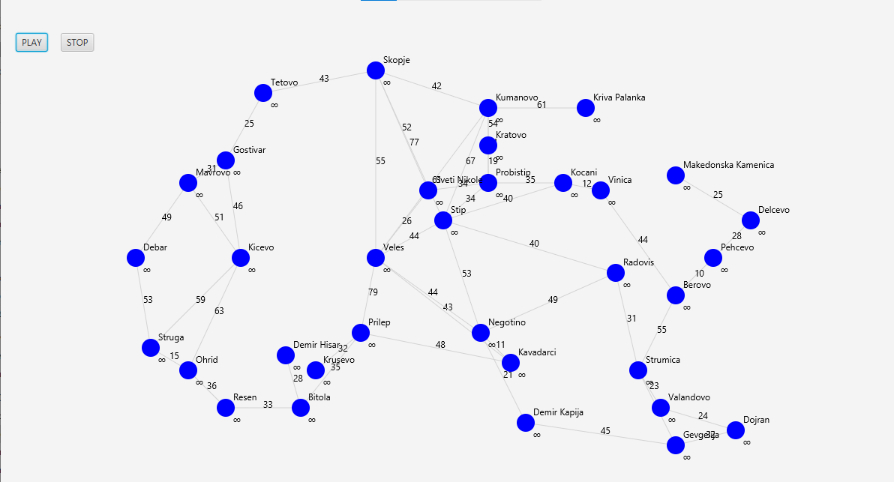
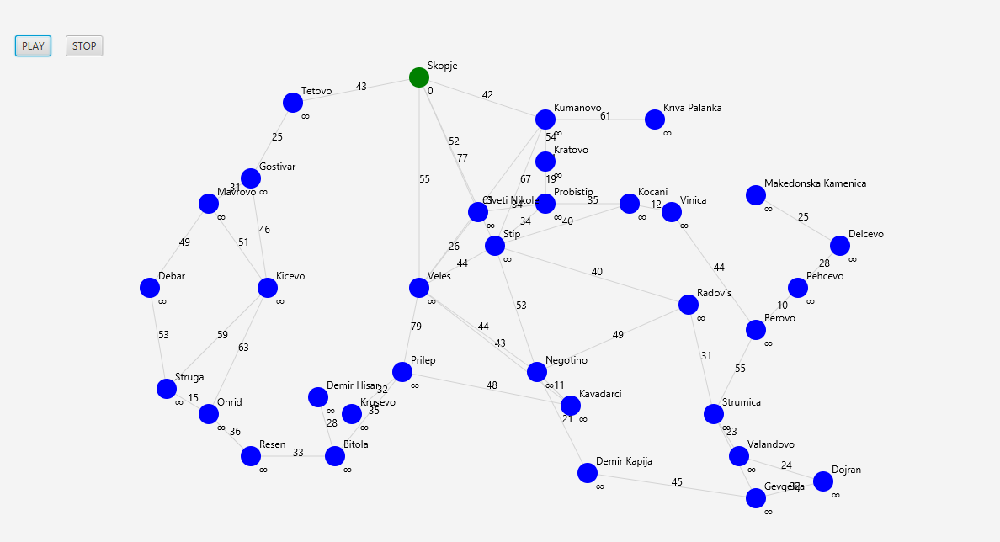
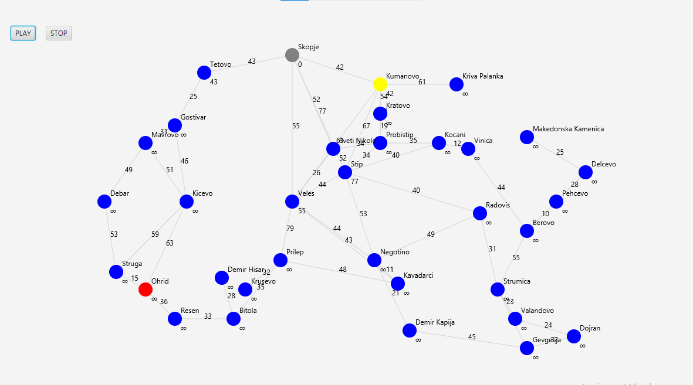
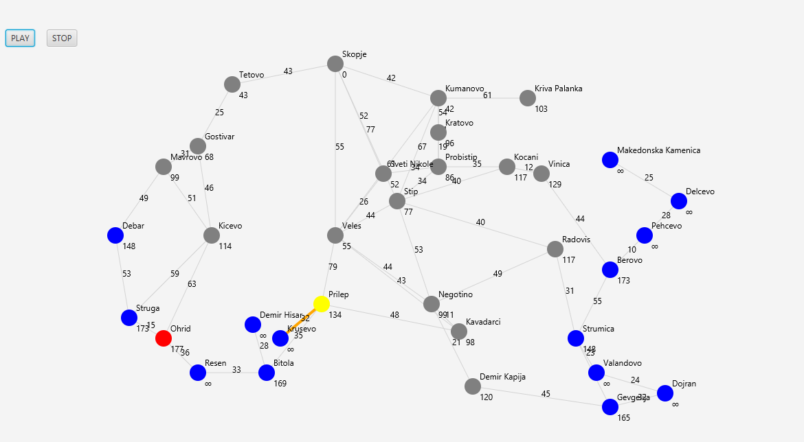
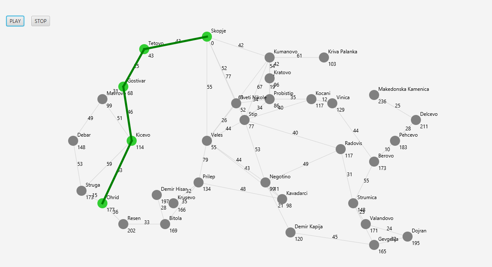

# Interactive Dijkstra Shortest-Path Visualizer & Road Network Simulator

An interactive Java desktop application that visualizes **Dijkstra's Shortest Path Algorithm** executing routing simulations across a custom-modeled highway and regional road network of North Macedonia. 

This project bridges abstract graph theory with real-time UI state graphics, showcasing optimal data structures and path-finding logic execution.

## 🚀 Key Technical Features

- **Graph Representation (Adjacency List):** The network of 34 major Macedonian cities is modeled as a weighted, undirected graph. Built using a Java `HashMap` layout where each key represents a city node, and values store a custom dynamic `List<Edge>` containing connected targets and precise driving distances in kilometers.
- **Dijkstra's Algorithm Implementation:** Optimized path exploration utilizing a Java `PriorityQueue` backed by custom runtime comparators (`Comparator.comparingInt`), guaranteeing an efficient execution bound of $O((V + E) \log V)$.
- **Dynamic Predecessor Tracing:** Features a backtracking traversal engine utilizing lookup tables to reverse-trace optimal parent states and display the final chronological travel itinerary.
- **Real-Time UI State Machine:** Dynamically updates node rendering colors to visually demonstrate algorithm transitions: unvisited states, priority queue node evaluations, processed pathways, and the final optimized trace.

---

## 📸 Step-by-Step Algorithm Simulation

Below is the visual execution breakdown of the algorithm finding the absolute shortest driving distance between **Skopje** and **Ohrid**.

### 1. Initial State (Graph Configuration)
The algorithm mapping triggers the base road network environment. All city distances (except the source city, Skopje, which is initialized at 0) are set to infinite ($\infty$) inside the shortest-path estimate matrix.


### 2. Node Discovery & Queue Ingestion
As the simulation executes, the algorithm pops the lowest-distance node from the Priority Queue and expands its neighbors, dynamically evaluating current cumulative weights against older entry constraints.


### 3. Edge Relaxation in Progress
Neighboring pathways are evaluated sequentially. Edges undergo "relaxation"—updating optimal discovery tracking variables whenever shorter alternate paths across the grid are mapped.



### 4. Final Path Resolution (Skopje ➔ Ohrid)
Once the destination node (Ohrid) is processed, the backtracking engine dynamically traces parent nodes backward to draw the final optimized green route: **Skopje ➔ Tetovo ➔ Gostivar ➔ Kicevo ➔ Ohrid**, computing a total driving path of exactly **177 km**.


---

## 🛠️ Tech Stack & Architecture

- **Language:** Java (JDK 8 or higher)
- **GUI Engine:** Standard Desktop Graphics Library / Swing Layouts
- **Algorithms:** Dijkstra's Shortest Path, Greedy Optimization, List Backtracking
- **Data Structures:** Adjacency Lists (`HashMap`, `ArrayList`), Priority Queues (`Min-Heap` logic)

## 💻 How to Run the Code Locally

1. Clone this repository:
```bash
   git clone [https://github.com/StefanieF2004/Macedonian-Road-Network-Dijkstra.git](https://github.com/StefanieF2004/Macedonian-Road-Network-Dijkstra.git)
2. Navigate to the project directory and compile the primary class:

Bash
   javac PatnaMrezaMakedonija.java
Execute the simulation tool:

Bash
   java PatnaMrezaMakedonija
3. Enter your chosen starting city and target destination within the execution prompts to trigger the simulation.
